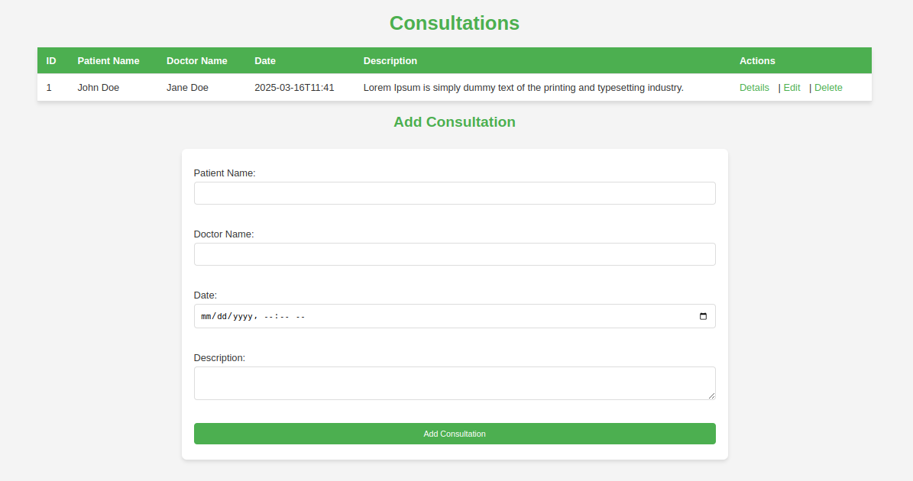

# Consultation Management Application

This is a Spring Boot web application for managing consultations. It uses an H2 in-memory database for data storage and provides a simple interface to add, view, edit, and delete consultations.

## Features
- **Add Consultations**: Add consultations with patient name, doctor name, date, and description.
- **View Consultations**: View all consultations in a table.
- **View Details**: View detailed information about a specific consultation.
- **Edit Consultations**: Update existing consultations.
- **Delete Consultations**: Remove consultations from the system.
- **H2 Database**: In-memory database for easy setup and testing.

## Technologies Used
- **Spring Boot**: Backend framework.
- **H2 Database**: In-memory database for development.
- **Thymeleaf**: Server-side Java template engine for rendering HTML.
- **Maven**: Build and dependency management.

## Prerequisites
- Java 17 or higher.
- Maven 3.x or higher.
- IntelliJ IDEA (or any other IDE).

## Setup Instructions

###  Clone the Repository
```bash
git clone https://github.com/Abdelouahed06/Enset-Gestion-Consultations-SpringBoot.git

## Screenshot

